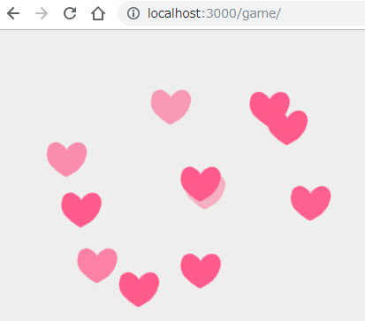

# ハートを出すツール（マルチプレー版）

**ハートを出すツール（マルチプレー版）**は実験放送向けの放送ツールです。



[Akashic Engine](https://akashic-games.github.io/)で制作されています。

このツールの制作の流れは、以下の記事で公開されています。

- https://dwango.github.io/niconico/jikken-housou/akashic-content2/

このツールをマルチプレーに対応させた様子は、以下のブロマガで公開されています。

- http://ch.nicovideo.jp/shin-ichiba/blomaga/ar1697055

## 利用方法

 `ハートを出すツール（マルチプレー版）` を利用するにはNode.jsが必要です。

初回のみ、以下のコマンドを実行して、ビルドに必要なパッケージをインストールしてください。
この作業は `ハートを出すツール（マルチプレー版）` を新しく生成するごとに必要です。

```sh
npm install
```

### 動作確認方法

以下を実行後、ブラウザで `http://localhost:3000/game/` にアクセスすることでゲームを実行できます。

* `npm start`

## エクスポート方法

`npm run export` で `atsumaru.zip` として[RPGアツマール用のファイル](https://game.nicovideo.jp/atsumaru/)を出力します。

このファイルを利用したRPGアツマールへの投稿方法は[こちらの記事](https://akashic-games.github.io/guide/export-atsumaru.html)をご参照ください。

## テスト方法

以下のコマンドで [ESLint](https://github.com/eslint/eslint "ESLint")を使ったLintが実行されます。
スクリプトアセット内にES5構文に反する記述がある場合エラーを返します。

```sh
npm test
```

## ライセンス

本リポジトリは MIT License の元で公開されています。
詳しくは [LICENSE](./LICENSE) をご覧ください。
 
ただし、画像ファイルおよび音声ファイルは
[CC BY 2.1 JP](https://creativecommons.org/licenses/by/2.1/jp/) の元で公開されています。
